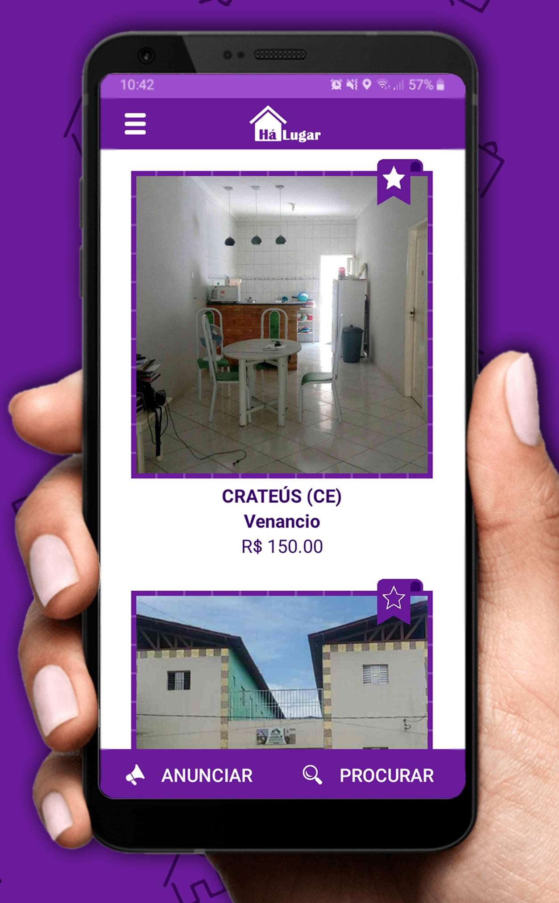
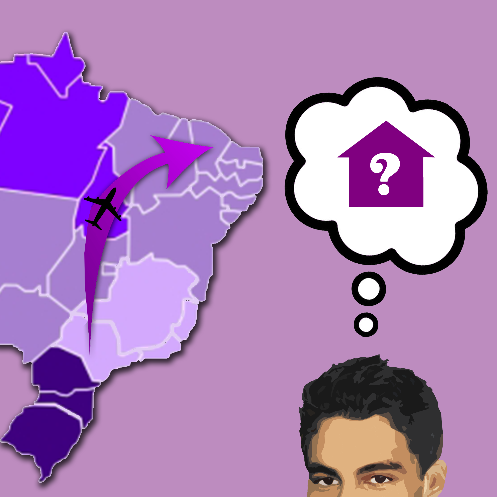
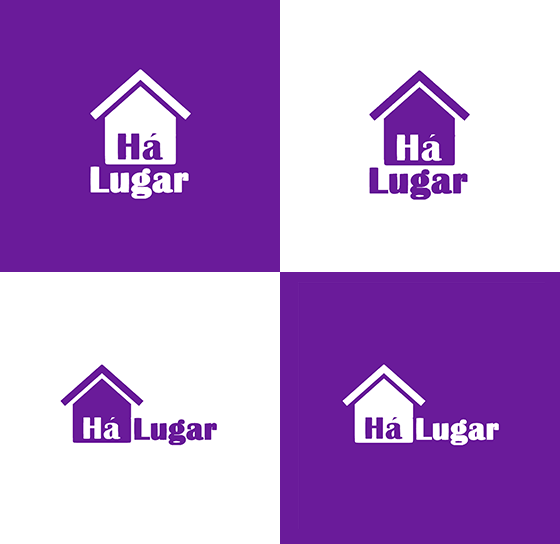
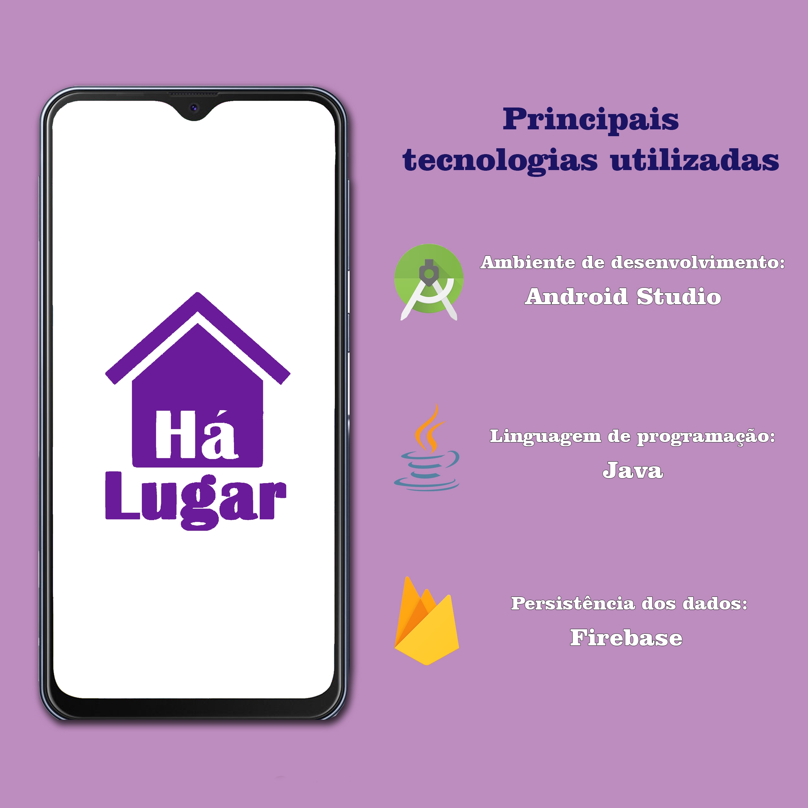

<h1 align="center" style="font-weight: bold;">
    À procura de um lugar?  
    HáLugar chegou para te ajudar!  
    
     
    
    
        
</h1>

HáLugar é voltado para estudantes que desejam compartilhar moradia, propondo possibilitar uma maior facilidade para que eles anunciem ou encontrem um lugar para morar. Por meio do aplicativo, eles poderão pesquisar quais as opções de moradia que lhes oferecem o melhor custo-benefício, ou seja, que possuem o preço de aluguel mais acessível, ou que são mais próximas do campus, do centro comercial, do ponto de ônibus e tudo mais que lhes for conveniente.

 

<h1 align="center" style="font-weight: bold;">
Principais funcionalidades  

</h1>

<ul align="justify">
<li> Mostrar prévia do anúncio (imagem principal, cidade, estado, bairro e preço mensal do aluguel) para usuários cadastrados ou não.</li> 

<li> Anunciar imóveis para alugar (com descrição e imagens).</li> 

<li> Manter lista de anúncios favoritos, permitindo ordenar por preço.</li> 

<li> Pesquisa personalizada (palavra-chave, intervalo de preço, bairro, cidade, estado, quantidade de vagas e raio de distância a partir da localização do usuário), permitindo ordenar por preço.</li> 

<li> Através da localização, visualizar anúncios que estão nas proximidades através do mapa.</li> 

<li> Contatar anunciante via email ou número de telefone.</li> 

<li> Reportar anúncio que vai contra os princípios do aplicativo.
<ul>

 

<h1 align="center" style="font-weight: bold;">
Motivação  

</h1>

A ideia da criação do HáLugar foi motivada pela experiência que tive ao me mudar de São Paulo (capital) para Crateús, onde, atualmente, curso Ciência da Computação na Universidade Federal do Ceará. Não conhecia a cidade e fiz um longo trajeto para poder encontrar uma moradia que se encaixasse no meu orçamento, e que pudesse me prover o mínimo de conforto, mesmo que um pouco distante do campus. Com o aplicativo, quero fazer com que os estudantes que residem em outras cidades e estados encontrem, de forma rápida e prática, um local para morar, e não passem pela dificuldade que vivenciei.

 

<h1 align="center" style="font-weight: bold;">
Identidade visual  

</h1>

Desde quando comecei a escrever poesia, em meados de 2012, venho adquirido uma facilidade muito grande para lidar com as palavras. Gosto muito de fazer trocadilhos, explorar neologismos e brincar com figuras de linguagem. As palavras vêm até mim naturalmente, sem que eu precise ficar muito tempo tentando idealizar algo. E foi assim que surgiu a ideia do nome "HáLugar", que remete justamente ao propósito do aplicativo. Uma vez com o nome criado, como também tenho experiência nas Artes Visuais, não foi muito difícil de criar a identidade visual, como elementos, seleção de cores etc. Neste quesito, sou um adepto do minimalismo, ou seja, me preocupo em fazer uso de poucos recursos fundamentais como base de expressão.

 

<h1 align="center" style="font-weight: bold;">
Tecnologias  

</h1>

Para as pessoas interessadas no processo de desenvolvimento, selecionei algumas das principais tecnologias que utilizei, tanto na questão de implementação quanto na de design:

:computer: Ambiente de desenvolvimento: [Android Studio](https://developer.android.com/studio)

:coffee: Linguagem de programação: [Java](https://docs.oracle.com/javase/7/docs/api/)

:fire: Persistência dos dados: [Firebase](https://firebase.google.com/)

:art: Ícones: [Krita](https://krita.org/en/) e [Inkscape](https://inkscape.org/)

:package: Dependências: [Google Maps](https://github.com/googlemaps/android-samples), [Dexter](https://github.com/Karumi/Dexter), [PhotoView](https://github.com/chrisbanes/PhotoView), [Compressor](https://github.com/zetbaitsu/Compressor)

:earth_americas: API: [Nominatim](https://nominatim.openstreetmap.org/)

 

<h1 align="center" style="font-weight: bold;">
Mídia  

</h1>

"Esse aplicativo foi desenvolvido pelo aluno Daniel Brito, do curso de Ciência da Computação da UFC – Campus Crateús, durante as disciplinas de Desenvolvimento de Software para Web e Desenvolvimento de Software para Dispositivos Móveis, ministradas pelo professor Francisco Anderson de Almada Gomes." <a style="font-style: normal" href="https://portalsertoes.com/2020/02/estudante-da-ufc-de-crateus-desenvolve-aplicativo-para-quem-deseja-compartilhar-moradia.html">(Matéria completa no Portal Sertões)</a>
